# Tyler Lum's GitHub Profile

## Research Interests

* :robot: Robotics Software
* :red_car: Autonomous Driving
* :cartwheeling: Complex Motion
* :man_health_worker: Medical AI
* :sailboat: Autonomous Sailing
* :eye: Computer Vision
* :speaking_head: Natural Language Processing

## Hobbies

* :boxing_glove: Boxing
* :martial_arts_uniform: MMA
* :volleyball: Volleyball
* :golf: Golf
* :flying_disc: Ultimate Frisbee

## GitHub Stats

<!-- Deploy Myself: https://github.com/anuraghazra/github-readme-stats -->

<!-- Public one is unreliable: https://github.com/anuraghazra/github-readme-stats -->
<!--  -->

<!--  -->

[Source](https://github.com/anuraghazra/github-readme-stats)

<!--
**tylerlum/tylerlum** is a ✨ _special_ ✨ repository because its `README.md` (this file) appears on your GitHub profile.

Here are some ideas to get you started:

- 🔭 I’m currently working on ...
- 🌱 I’m currently learning ...
- 👯 I’m looking to collaborate on ...
- 🤔 I’m looking for help with ...
- 💬 Ask me about ...
- 📫 How to reach me: ...
- 😄 Pronouns: ...
- ⚡ Fun fact: ...
-->
